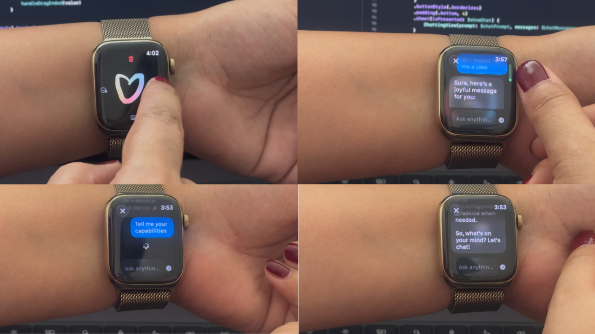

🧚‍♂️ Pixy - Literally the Smallest Functioning LLM Ever
===========================================================

Pixy is a fully self-contained machine learning inference framework
written entirely in Zig, designed to run quantized language models under
extreme memory and compute constraints. Optimized using Arm Performix.

The primary demonstration is Falcon H1 0.5B running as an 8-bit
quantized model on Apple Watch hardware.

Despite the limitations of wearable hardware, Pixy achieves approximately
1.5 tokens/sec on-device while maintaining language generation
quality thanks to following  implemented from scratch in pure Zig.

* Tensor operations.
* Quantization and dequantization.
* Matrix multiplication kernels.
* Convolution kernels.
* ARM SIMD acceleration.
* watchOS integration.

The inference runtime has no dependency on Python, PyTorch, TensorFlow,
ONNX Runtime, or libtorch. We are literally self contained within a unified Zig inference codebase. 
No external packages whatsoever. The scope is extremely narrowed to inferencing 8-bit and 
5_K_M/6_K_M mixed bit quantized GGUFs and pure Convolutional/MaxPool/Linear Layers for the CNN.

Optimizations
=============

Pixy relies heavily on Zig compile-time SIMD support for ARM NEON intrinsics.

Pragmas used include the below:

* ``@Vector`` SIMD operations.
* ``@mulAdd`` fused multiply-add.
* ``@reduce`` horizontal reductions.
* ``@shuffle`` vector operations.
* ``@select`` branchless conditionals.
* Vectorized quantization/dequantization.
* Compile-time loop unrolling.

License
=======

This project is licensed under the Apache License 2.0.

When used with Falcon H1 model weights, the model weights are licensed
separately under the Falcon-LLM License, which is derived from Apache 2.0.

Apache 2.0:

::

    https://www.apache.org/licenses/LICENSE-2.0

Falcon-LLM License:

::

    https://falconllm.tii.ae/falcon-terms-and-conditions.html
